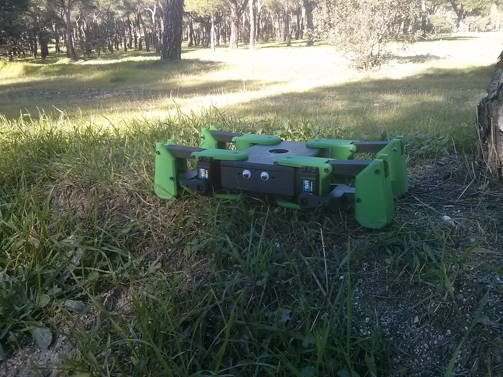

[Are you looking for the tiny version powered by an esp8266?](https://github.com/JavierIH/miniKame)

# KAME

Kame is an experimental quadruped walker with PLM legs. The main controller of this robot is a Raspberry Pi 2. Main code for locomotion and gaits is written in Python using oscillator algorithms.

# License

# Other

Sponsored by BQ till march 2016
